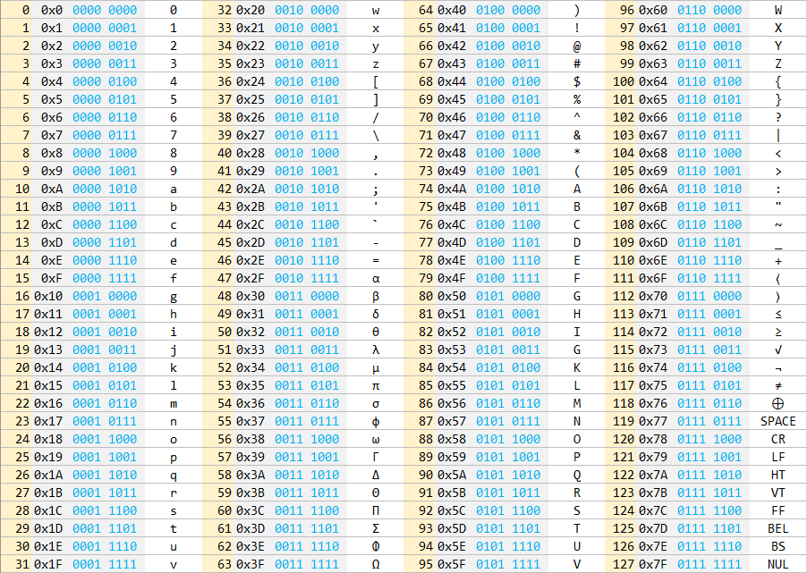

# MUSCII
**M**odernized and **U**pdated **S**tandard **C**ode for **I**nformation **I**nterchange, pronounced like "musky" (Probably needs a better name).

A modern replacement for ASCII that no one asked for...

## Brief Overview
 * All of the non-control ASCII characters were preserved (except for the 'DEL' character)
 * All C escape codes were preserved
 * Every non-shift character is present within the first 64 positions, with every shift character present in the last 64.
 * Any shift operation can be perform using a logical OR with the number 64 (i.e. one bit flip).
 * The control characters are directly opposite of the first 8 decimal numbers (0-7).
